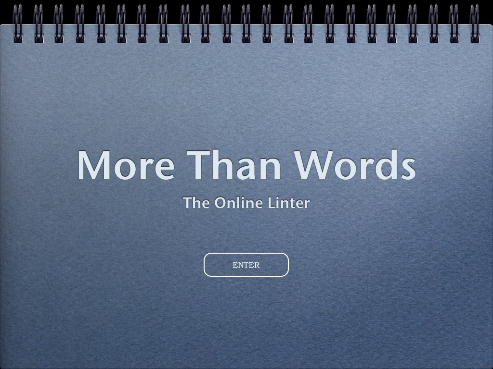
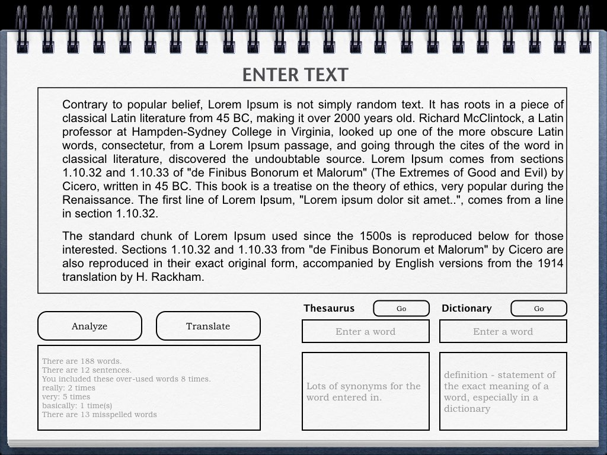

## More Than Words - ReadMe

#### Intro
Title: More Than Words - The Online Linter

**More Than Words - The Online Linter** will accept user text, analyze it and return _word count_, _sentence count_, _over-used-words count_. Extra features will use Oxford Dictionary API to allow for word look-up and Thesaurus results. An optional feature may include Google Translate API to translate the user's text.

#### Setup
1. Sketch initial page layout.

  
  

2. Make static HTML page with this initial layout along with CSS Flexbox

3. Start React project
4. Divide HTML page into React components and move CSS over to component stylesheets.
5. Determine methods for UI functionality and which states will change and any onClick events to handle.
6. Add utility files for Oxford API and Google APIs

#### Usage
This project is part of my exercises to take basic JavaScript projects (which were part of the React course at Code Academy), and make them into basic React apps.  I'm also using these exercises to practice *app-building workflow* from sketching UI to delivering first MVP plus a feature requests list.
