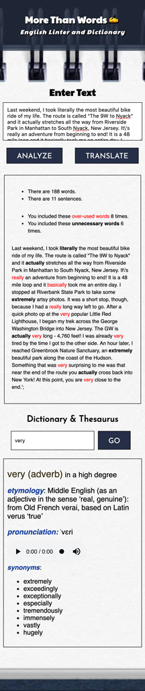

## More Than Words

#### Intro
Title: More Than Words - English Linter and Dictionary

by Steve Hanlon

**More Than Words - English Linter and Dictionary** accepts English text, analyzes it, and returns  _word count_, _sentence count_, and _over-used-words count_.

The bottom part of the UI offers a word look-up feature using Oxford's Dictionary API.

##### Start-up Server

To run the server, NPM or Yarn must be installed.

Open up the terminal and go to the project directory.  Inside of the project directory, run:

`npm install`

`npm start`

If you have Yarn installed run:

`yarn start`

This project was built using *Create React App*.  For complete technical details click [Create React App](./docs/README.md)

##### Technical Components
- CSS Flexbox and Media Queries used to build the _responsive features_.
- JavaScript (ECMASript 6)
- React 16.5.2

##### Classes, Articles and Tutorials
Classes, tutorials, articles and docs used while building this app.

This project was part of my exercises to take basic JavaScript projects (which were part of the React course at Code Academy), and make them into React apps.  I also used these exercises to practice *app-building workflow* from sketching UI to delivering first MVP, plus a feature-requests list.

- *Code Academy - JavaScript and React Course*, [Linter Project](https://www.codecademy.com/programs/f151998eb027eb35e15b2081ee6ef9a0/items/fad8e5607a0fdd1b45123a6a3eec1813)
- [Oxford API](https://developer.oxforddictionaries.com/)
- [React Docs](https://reactjs.org/docs/getting-started.html)

#### Picture of Data and Components Breakdown

#### Pictures of Responsive Design
##### Phone

##### Tablet

##### Desktop

### Future Features
- include Google Translate API to translate text other than English.
