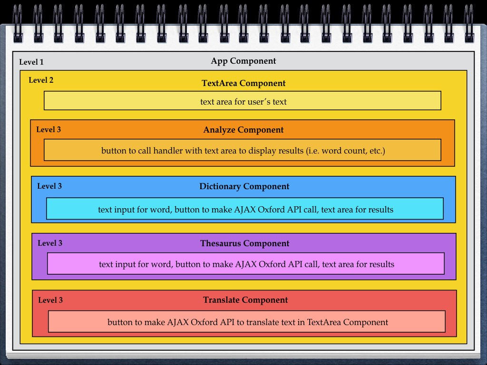

__Title__: More Than Words - The Online Linter
By: Steve Hanlon Dec. 8, 2017

__Goal__: Develop a React App based on the [Mini-Linter project at Code Academy](https://www.codecademy.com/programs/f151998eb027eb35e15b2081ee6ef9a0/items/fad8e5607a0fdd1b45123a6a3eec1813) but also add Oxford Dictionary API to allow for Dictionary and Thesaurus results.

#### Work flow
1. Develop index.html static site with hard-coded content.

2. Create React project
3. Create Components based on HTML static site then create Component Directories with JS and CSS files.
4. Copy/Paste the hard-coded HTML and CSS into the various React components, rewrite file/link paths

5. Create logic through methods, pass props, change states, onClick and onChange handlers
  - App
    - container component
    - Receive text input
    - Analyze it with methods
  - TextArea
    - presentational component
  - Analyze
    - Set up onClick handler to analyze textArea
  - Dictionary
    - Set up onClick handler to make API call
  - Thesaurus
    - Set up onClick handler to make API call

#### Programming flow
**Component Level Map**

**Component Mapping**

- **App** component - to handle logic and states and render all Level 2 and 3 components, header Title

 - **TextArea** component renders text area, Analyze Button, Dictionary input/text/button, Thesaurus input/text/button, Translate button

    - **Analyze** component - to handle analyzing TextArea text input
    - **Dictionary and Thesaurus** components - render buttons with onClick to call API
      - API utility component for AJAX call to Oxford API

#### Future Feature Requests

  - **Translate** component  - render button with onClick to call Google API
